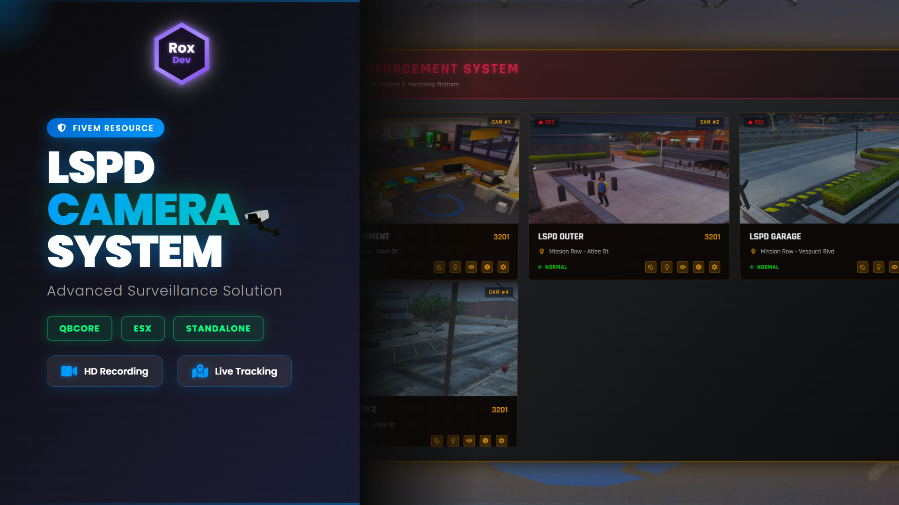

# 🎥 RoxCam Pro V1 — Advanced Law Enforcement CCTV System


A complete, feature-rich CCTV surveillance system designed for law enforcement roleplay and security operations. Monitor your city in real-time with advanced camera placement, live feeds, and powerful viewing features.

> 🔓 **Full source code — No escrow, no encryption.**

---

## 📸 Preview

<!-- Add your screenshots here -->


🎬 **[Watch Video Preview](https://www.youtube.com/watch?v=eT0SQnkEeSQ)**

---

## ⚡ Features

### 📷 Camera System
- **Unlimited camera placement** anywhere on the map
- **Live feed monitoring** from centralized stations
- **Thermal vision** toggle for enhanced surveillance
- **Night vision** support for complete darkness
- Full **camera management** (edit, delete, organize)

### 🎯 Placement System
- `WASD + Z/X` — Move camera position
- `Arrow Keys` — Rotate camera angle
- Custom camera names & notes
- Placement history (who placed, when, and why)

### 🖥️ Monitoring Station
- Centralized control for all cameras
- **Live screenshot** capture via Discord webhooks
- View placement date, time, operator, and notes
- Press `E` to enter monitoring mode instantly

### 🔧 Customization
- ESX, QBCore & Standalone support
- Configurable commands and permission system
- Custom monitoring station locations
- Discord webhook integration

---

## 📋 Requirements

| Dependency | Link |
|---|---|
| `screenshot-basic` | [GitHub](https://github.com/citizenfx/screenshot-basic) |
| `ESX` or `QBCore` | Your framework of choice |
| `oxmysql` or `mysql-async` | For database support |

---

## 🚀 Installation

1. **Download** the resource from [Tebex](https://roxdev.tebex.io/package/roxcam-pro-v1)
2. **Extract** the ZIP and drag the folder into your `resources` directory
3. **Import** the SQL file into your database
4. **Configure** your framework and settings in `config.lua`
5. **Add** `ensure roxcam-pro` to your `server.cfg`
6. **Start** your server — done in under 5 minutes!

> ⚠️ Make sure `screenshot-basic` is started **before** RoxCam Pro.

---

## ⚙️ Configuration

Open `config.lua` to configure:

```lua
Config.Framework = "qbcore"  -- "esx" | "qbcore" | "standalone"
Config.PlacementCommand = "placecam"
Config.DiscordWebhook = "YOUR_WEBHOOK_URL"

Config.MonitoringStations = {
    { coords = vector3(0.0, 0.0, 0.0), label = "Police HQ" },
}
```

Full configuration documentation is included in the package.

---

## 📁 File Structure

```
roxcam-pro/
├── client/
│   └── client.lua
├── server/
│   └── server.lua
├── html/
│   ├── index.html
│   ├── style.css
│   └── app.js
├── sql/
│   └── roxcam.sql
├── config.lua
├── fxmanifest.lua
└── README.txt
```

---

## ⚠️ Important Notes

- **No Refunds** — Digital products are non-refundable after download
- **No Reselling** — You may not resell, redistribute, or share this resource
- **Framework Compatibility** — QBCore/ESX supported; modify faction/job access via `qb-policejob` or `esx_policejob`

---

## 🛒 Download

**[👉 Get RoxCam Pro V1 for FREE on Tebex](https://roxdev.tebex.io/package/roxcam-pro-v1)**

---

## 💬 Support & Community

- 🐛 **Bug reports** — Open an [issue](../../issues)
- 💡 **Suggestions** — Open a [discussion](../../discussions)
- 📢 **Forum post** — [Cfx.re Community](https://forum.cfx.re/t/free-roxcam-pro-v1-advanced-law-enforcement-cctv-system/5376430)

---

<p align="center">Made with ❤️ by <strong>Nyrox</strong></p>
